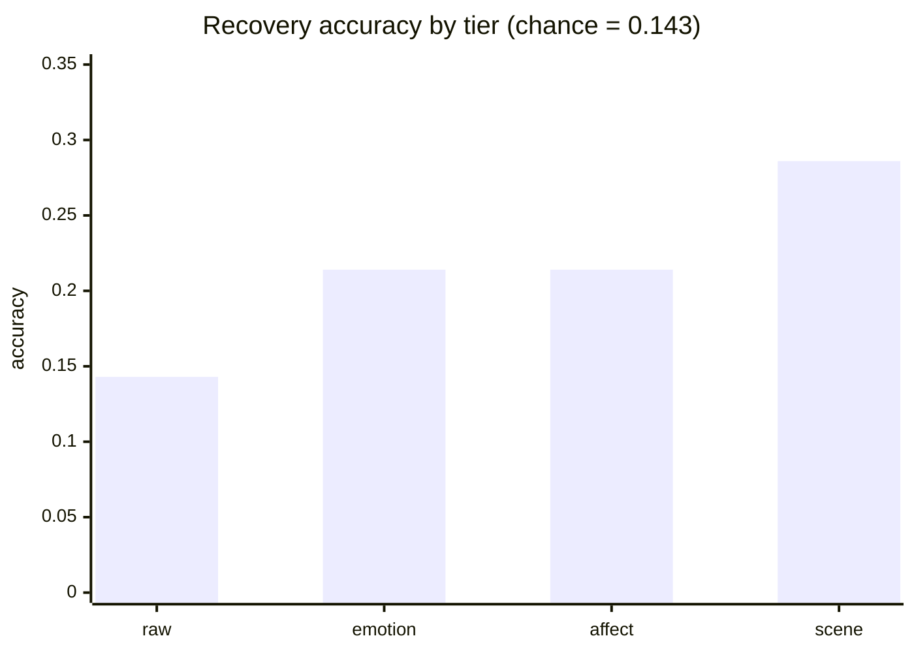

# NovaVision: A Reproducible Protocol for Measuring Emotion Controllability in Text-to-Image Generation, and Why Zero-Shot Round-Trip Recovery Fails

**Can emotion conditioning actually steer what a generated image conveys?** **Not measurably yet: under a protocol built to catch self-deception, no conditioning tier beats chance, and the apparent lift vanishes once the probe's measured error is corrected for.**

[Paper](paper/paper.md) · [Colab](reproduce.ipynb) · [Preregistration](PREREGISTRATION.md) · [Runbook](RUNBOOK.md) · [Benchmark your system](#applications)


## Results

The committed run is a CPU pilot (SD-Turbo generator, CLIP ViT-B/32 probe, n=14 per tier). It is reported as a calibration of the instrument, not a controllability score.

| Condition | Recovery acc [95% CI] | Macro-F1 | Shuffled-label p | n | Reading |
|---|---|---|---|---|---|
| raw (neg. control) | 0.143 [0.00, 0.36] | 0.038 | 0.857 | 14 | sits exactly at chance (1/7) |
| emotion | 0.214 [0.00, 0.43] | 0.112 | 0.226 | 14 | not above the circularity baseline |
| affect | 0.214 [0.00, 0.43] | 0.133 | 0.137 | 14 | not above the circularity baseline |
| scene (pos. control) | 0.286 [0.00, 0.58] | 0.184 | 0.145 | 7 | highest, still n.s. |



| Contrast | Delta acc | 95% CI | Cohen's h | p |
|---|---|---|---|---|
| emotion vs raw | +0.071 | [0.000, 0.214] | +0.187 | 0.255 |
| affect vs emotion | +0.000 | [0.000, 0.000] | +0.000 | 1.000 |
| affect vs raw | +0.071 | [0.000, 0.214] | +0.187 | 0.255 |

**The committed pilot is an honest, multiply-guarded null.** The probe collapses onto neutral on generated scenes (2 of 7 labels, 90% of items), no tier clears the shuffled-label control (Holm-adjusted p = 0.27 across tiers), and correcting recovery for the probe's measured error moves the emotion tier from an apparent 0.214 back to 0.165, at chance. Chance = majority baseline = 0.143.

| System | Track | raw | emotion | affect | scene | Cleared shuffled-label? |
|---|---|---|---|---|---|---|
| SD-Turbo + CLIP ViT-B/32 (committed pilot) | content | 0.143 | 0.214 | 0.214 | 0.286 | no (honest null) |

Read it honestly:

- The probe, not the generator, is the binding limit: it reads real emotional photos at 40.3% (all 7 labels) yet collapses on the pilot's generated 256-px images, so no recovery number, null included, is yet interpretable as controllability.
- A chance-level result alone is uninformative: a collapsed probe scores at the majority baseline regardless of the image, which is why every number ships beside its collapse diagnostic.
- The powered run (n=420, 95%+ power for even a weak effect) is deliberately withheld until a probe clears the in-domain gate; analysis is locked in the [preregistration](PREREGISTRATION.md).

Full write-up: [paper/paper.md](paper/paper.md). The underlying records and derived metrics are drift-locked by `make repro-check` in CI; the tables here are rendered snapshots of the same artifacts (`make paper`).

## Checks

One check per failure mode, in the style of an instrument audit:

| Check | Question | Result |
|---|---|---|
| Chance floor (raw) | Does no-emotion score above 1/7? | 0.143, exactly chance |
| Template ceiling (scene) | How much is pure scene recognition? | 0.286, the upper bound |
| Decoupled content | Can emotion leak through the subject? | No: neutral subjects, same seeds per tier |
| Shuffled labels (n = 2000) | Is recovery just chance agreement? | emotion p = 0.23, affect p = 0.14 |
| Holm correction | Does anything survive family-wise control? | No, adjusted p = 0.27 |
| Probe collapse diagnostic | Is the probe even using its labels? | 2 of 7 labels, 90% neutral |
| Rogan-Gladen correction | Does the lift outlive probe error? | 0.214 corrects to 0.165, chance |
| Provenance manifest | Could numbers drift silently? | git SHA, model revisions, device, benchmark hash logged per run |

**Probe gate.** A probe must read real images before its verdict on generated ones counts:

| Probe | Faces | Scenes (EmoSet) | Verdict |
|---|---|---|---|
| CLIP ViT-B/32 (pilot) | 29.0% | 40.3% | fails the gate |
| CLIP ViT-L/14 | 37.5% | 45.5% | candidate (McNemar p = 0.038 / 0.040) |

## Screenshots

| Main interface | Emotion analysis |
|:---:|:---:|
|  |  |

## Parameters

| Parameter | Committed pilot | Powered run (registered) |
|---|---|---|
| Generator | stabilityai/sd-turbo (pinned revision) | same, swappable via DIFFUSION_MODEL |
| Recovery probe | openai/clip-vit-base-patch32 (pinned) | gate-passing probe (ViT-L/14 candidate) |
| Text classifier | j-hartmann/emotion-english-distilroberta-base | same |
| Image size | 256 x 256 | 512 x 512 |
| Content subjects | 2 | 20 |
| Seeds per item | 1 | 3 |
| n per conditioning tier | 14 (scene: 7) | 420 (scene: 21) |
| Power at n=420 | n/a | 95%+ for effect s=0.2 (`make power`) |

Source of truth: the run manifest in [results/paper/results.json](results/paper/results.json) and [PREREGISTRATION.md](PREREGISTRATION.md).

## Method


Detect the emotion in text (DistilRoBERTa), ground valence/arousal (lexicon blended with the circumplex prior, cap 0.8), condition the prompt, generate (SD-Turbo, fixed paired seeds), then recover the emotion from the image with a swappable probe and compare to the intent. The tiers are the ablation: content is never chosen by the emotion, so recovery can only come from the conditioning.

| Tier | Prompt | Example fragment (sadness) |
|---|---|---|
| raw | content + style | negative control, no emotion at all |
| naive | content + emotion word | "sadness" |
| emotion | content + mood phrase | "sad melancholic mood, somber wistful atmosphere" |
| affect | emotion tier + palette and lighting from valence, arousal | "cool desaturated palette, muted blue-grey tones, soft gentle lighting" |
| scene | fixed per-emotion scene, no content | "a misty rain-soaked forest at dusk" (template ceiling) |

- Valence maps to palette: warm golden above +0.33, cool desaturated blue-grey below -0.33.
- Arousal maps to lighting: dramatic high contrast above 0.66, soft and calm below 0.33.
- AffectBench hygiene: GoEmotions test split, within-sample and cross-split deduplication, realized per-class counts recorded.

## Figures


Accuracy per tier against chance, and the raw-tier confusion matrix showing the probe's collapse onto neutral.

<details>
<summary><b>All confusion matrices and the valence-arousal map</b></summary>
<br>

| emotion tier | affect tier |
|:---:|:---:|
|  |  |
| **scene ceiling** | **valence, arousal by emotion** |
|  |  |

</details>

## Key terms

| Term | Meaning |
|---|---|
| Valence, arousal | How positive and how activated an emotion is; the two axes of Russell's circumplex |
| Tier | One rung of the conditioning ladder: raw, naive, emotion, affect, plus the scene ceiling |
| Probe | The model that reads the emotion back off the generated image |
| Recovery accuracy | How often the probe's read matches the intended emotion |
| Shuffled-label control | Rerun scoring with targets randomly reassigned; real signal must beat it |
| Probe gate | Minimum accuracy on real images before a probe's verdict counts |

## Toolkit

```
make setup          # core + dev deps (deterministic, no models)
make test           # 200 tests, runs in seconds
make repro-check    # re-derive committed headline numbers from committed records
make power          # sample-size analysis for the powered run
make correct-recovery       # probe-error-corrected recovery (Rogan-Gladen)

make setup-ml       # model runtime (downloads SD-Turbo, CLIP, the classifier)
make app            # web app at http://127.0.0.1:8000 (make serve-prod for public binds)
make pilot          # regenerate the committed CPU pilot
make reproduce      # powered content-track run (GPU box; --resume built in)
make validate-probe-scene   # in-domain probe ceiling on EmoSet
make paper          # regenerate tables and figures from results
```

No local setup: [reproduce.ipynb](reproduce.ipynb) runs clone-install-test-reproduce in Colab. Exact paper environment: `uv pip install -r requirements.lock`. Python API: `from novavision import build_pipeline`. Score your own system and submit: `make submission SYSTEM="name"` validates against [benchmark/submission.schema.json](benchmark/submission.schema.json), numbers copied from results, never hand-entered.

## Applications

| Application | Entry point |
|---|---|
| Benchmark a new generator under the frozen protocol | `make reproduce DIFFUSION_MODEL=<hf-id>` |
| Validate or compare recovery probes | `make validate-probe-scene`, `make validate-probe-hf` |
| Correct recovery for a probe's known error | `make correct-recovery` |
| Plan a properly powered study | `make power` |
| Emotion-conditioned art, interactively | `make app` |
| Ground the probe against human raters | [docs/human_study_protocol.md](docs/human_study_protocol.md) |

## Limitations

- The probe is the binding limit: it reads real scenes at 40.3% yet collapses on generated ones, so no recovery number is interpretable as controllability yet.
- Pilot scale: n = 14 per tier at 256 px; treat every interval as wide by design.
- Prompt-level conditioning only; no fine-tuning, adapters, or guidance.
- Seven Ekman labels plus neutral; standard image-emotion evaluators train on Mikels' eight, so cross-taxonomy comparison needs the paper's mapping.
- On the content track, valence and arousal are per-emotion priors, so the affect tier measures palette and lighting strength, not text grounding.
- AffectBench inherits GoEmotions' Reddit-English domain and its modest annotator agreement.

## Tech Stack

| Layer | Tools |
|---|---|
| ML / NLP | PyTorch, Transformers, Diffusers (SD-Turbo), CLIP, DistilRoBERTa |
| Application | Flask, Gradio, gunicorn |
| Data / research | NumPy, Pillow, pydantic, matplotlib, HF datasets (GoEmotions, EmoSet) |
| Tooling / CI | pytest, ruff, mypy, gitleaks, pip-audit, GitHub Actions, Docker, uv |

## Docs

| Doc | Purpose |
|---|---|
| [paper/paper.md](paper/paper.md) | Full write-up; tables auto-injected from results |
| [PREREGISTRATION.md](PREREGISTRATION.md) | Hypotheses, n, and analysis locked before the powered run |
| [RUNBOOK.md](RUNBOOK.md) | Ordered GPU-day checklist with acceptance gates |
| [MODEL_CARD.md](MODEL_CARD.md) | Intended use, out-of-scope uses, limitations |
| [ARCHITECTURE.md](ARCHITECTURE.md) | How the pipeline and harness fit together |
| [PROVENANCE.md](PROVENANCE.md) | Every model and eval prompt, pinned to exact revisions |
| [data/DATASHEET.md](data/DATASHEET.md) | The AffectBench data card |
| [CONTRIBUTING.md](CONTRIBUTING.md), [SECURITY.md](SECURITY.md), [CODE_OF_CONDUCT.md](CODE_OF_CONDUCT.md), [CHANGELOG.md](CHANGELOG.md) | Community and release docs |

## References

- [Russell (1980)](https://doi.org/10.1037/h0077714): the circumplex model; supplies the valence/arousal axes.
- [Demszky et al. (2020)](https://arxiv.org/abs/2005.00547): GoEmotions; the text source AffectBench is built from.
- [Warriner et al. (2013)](https://doi.org/10.3758/s13428-012-0314-x): affect norms; the research-grade lexicon option.
- [Radford et al. (2021)](https://arxiv.org/abs/2103.00020): CLIP; the default recovery probe, treated as an instrument to validate.
- [Sauer et al. (2023)](https://arxiv.org/abs/2311.17042): adversarial diffusion distillation; the SD-Turbo generator.
- [Yang et al. (2023)](https://arxiv.org/abs/2307.07961): EmoSet; the in-domain set the probe ceiling is measured on.
- [Rogan and Gladen (1978)](https://doi.org/10.1093/oxfordjournals.aje.a112510): prevalence correction; deconvolves probe error from recovery.
- [Holm (1979)](https://www.jstor.org/stable/4615733): the family-wise correction applied across tiers.
- [Gebru et al. (2021)](https://arxiv.org/abs/1803.09010): datasheets for datasets; the template for the AffectBench card.
- [Mikels et al. (2005)](https://doi.org/10.3758/BF03192732): the eight-category taxonomy image-emotion evaluators are trained on; motivates the mapping in section 7 of the paper.
- [Stein et al. (2023)](https://arxiv.org/abs/2306.04675): precedent that critiquing a generative-evaluation metric is itself a contribution.
- [Othmen et al. (2026)](https://arxiv.org/abs/2606.13247): EPIG, the closest training-free valence/arousal conditioning peer.
- EmoGen, EmotiCrafter, EmoEdit, MUSE, CoEmoGen: the emotion-conditioned generation systems the protocol is built to compare (see paper references).

## License

Code is [MIT](LICENSE). This covers the source only: model weights, datasets, and affect norms keep their own terms, several non-commercial. See [THIRD_PARTY_LICENSES.md](THIRD_PARTY_LICENSES.md).
