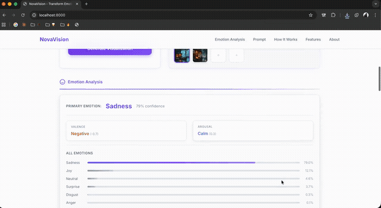
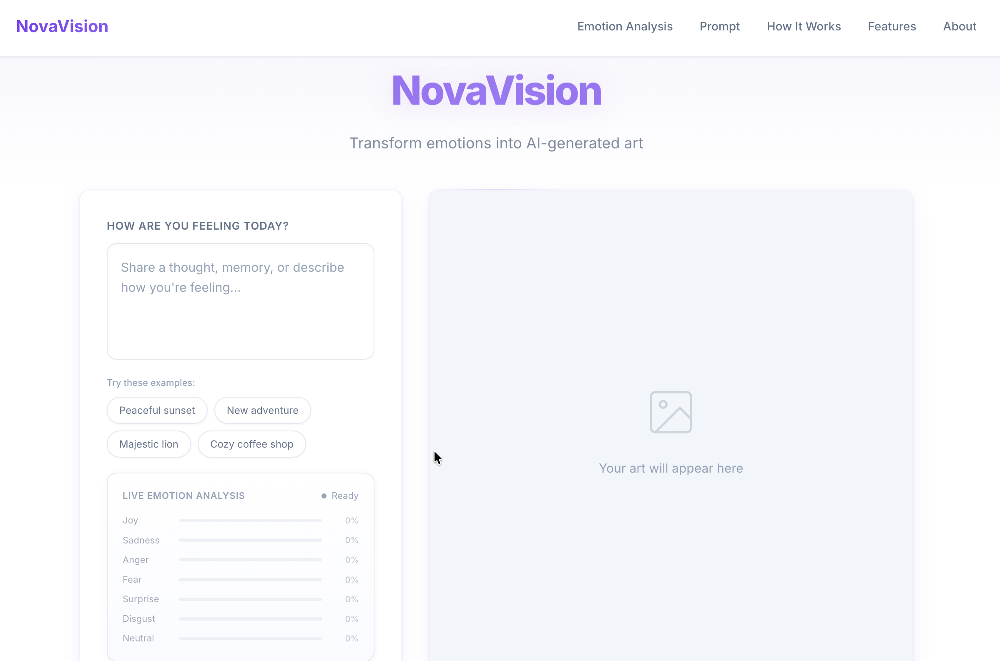
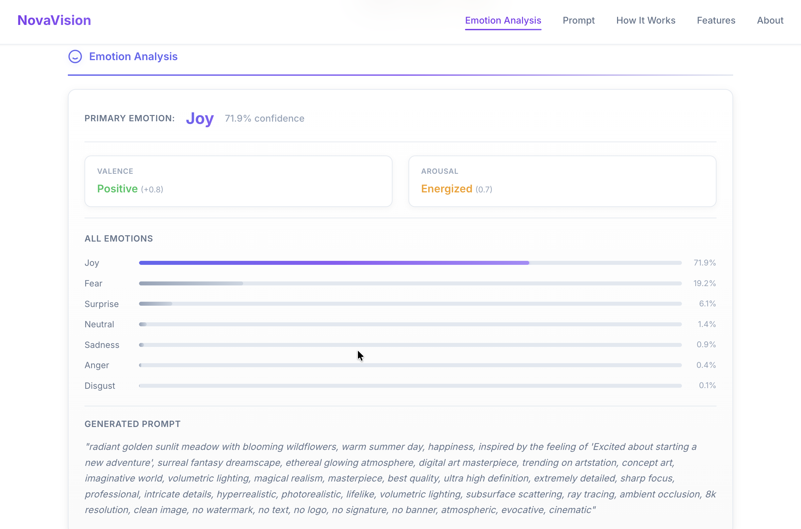
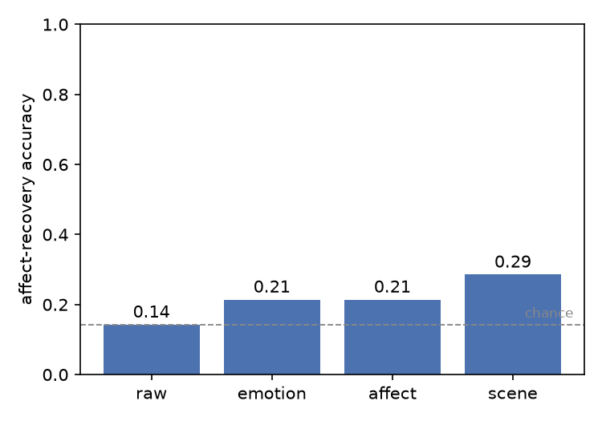
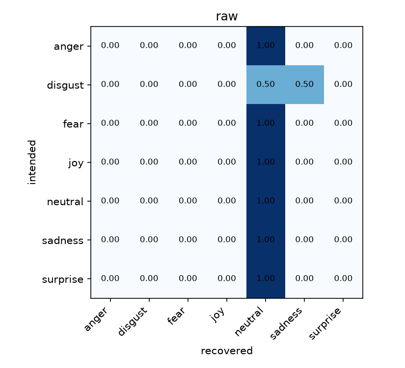
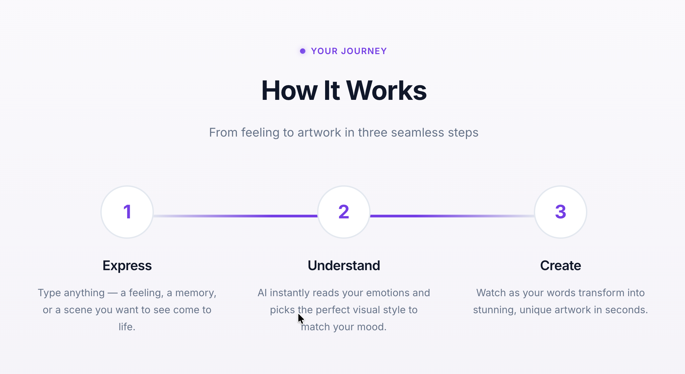

# NovaVision

NovaVision generates an image from the emotion of a sentence, then checks whether the image actually conveys that emotion by recovering the emotion back from it with a swappable probe and comparing it to what you asked for. It is two things sharing one pipeline, a text-to-art web app and an emotion-controllability benchmark, built around the failure modes that make such a measurement easy to fake, with a frozen text benchmark (AffectBench) and a full write-up behind it.



## Using it

- Run `make setup` then `make test` to exercise the deterministic core with no model downloads, then `make setup-ml` and `make app` to launch the web app at http://127.0.0.1:8000 and generate emotion-conditioned images interactively.
- `make smoke` is a quick end-to-end run (2 subjects, 1 seed); `make pilot` reproduces the committed CPU pilot (n=14 per tier).
- Build the text benchmark with `make benchmark` (AffectBench from GoEmotions), then run the text-conditioned track with `make text`.
- For a public deployment, bind explicitly with `NOVA_PUBLIC=1` and set `NOVA_API_TOKEN`, `NOVA_RATE_LIMIT`, and `NOVA_MAX_CONCURRENCY`; the app binds 127.0.0.1 by default. Serve with `make serve-prod` (gunicorn) rather than the built-in development server.
- Deploying on Hugging Face Spaces: `app.py` is the Gradio entry point; copy the [spaces_config.yaml](spaces_config.yaml) block into the Space's README frontmatter.

## Screenshots





## Results

A CPU pilot: 256-px, 2 content subjects, single seed, n=14 per conditioning tier (n=7 for scene), diffusers backend with stabilityai/sd-turbo and openai/clip-vit-base-patch32.

What this pilot reports is not a controllability score, it is a calibration of the instrument. **The committed pilot is an honest null: no conditioning tier beats the shuffled-label control, so recovery is statistically indistinguishable from chance label agreement.** The protocol, floors, and diagnostics all run end to end; the binding limitation is the probe.



| Condition | Recovery acc [95% CI] | Macro-F1 | Valence rho [95% CI] | Arousal rho [95% CI] | CLIP-T | Shuffled-label p | n | Reading |
|---|---|---|---|---|---|---|---|---|
| `raw` (neg. control) | 0.143 [0.00, 0.357] | 0.038 | 0.076 [-0.47, 0.55] | 0.546 [-0.00, 0.90] | 0.280 | 0.857 | 14 | sits exactly at chance (1/7) |
| `emotion` | 0.214 [0.00, 0.429] | 0.112 | 0.474 [-0.03, 0.78] | 0.474 [-0.03, 0.80] | 0.274 | 0.226 | 14 | not above the circularity baseline |
| `affect` | 0.214 [0.00, 0.429] | 0.133 | 0.241 [-0.30, 0.65] | 0.618 [0.19, 0.86] | 0.270 | 0.137 | 14 | not above the circularity baseline |
| `scene` (pos. control) | 0.286 [0.00, 0.575] | 0.184 | 0.414 [-0.63, 1.00] | 0.582 [-0.43, 0.99] | n/a | 0.145 | 7 | highest, but still n.s. |

Chance = 0.143 (1/7); majority-class baseline = 0.143. Probe health: 2/7 labels used, `neutral` predicted for ~90% of items (majority_rate 0.9048).

Paired contrasts (bootstrap on per-item recovery):

| Contrast | Delta accuracy | 95% CI | p |
|---|---|---|---|
| emotion vs raw | +0.071 | [0.000, 0.214] | 0.255 |
| affect vs emotion | +0.000 | [0.000, 0.000] | 1.000 |
| affect vs raw | +0.071 | [0.000, 0.214] | 0.255 |



- The `raw` negative control sits exactly at chance (1/7), and `scene` at 0.286 is the highest tier but still *not significant*.
- The CLIP ViT-B/32 probe **collapses in-domain onto `neutral`**, predicting it for ~90% of generated scenes and using only 2 of 7 labels.
- The one apparent lift is a single image and *not significant*: emotion over raw is +0.071 (95% CI [0.000, 0.214], p=0.255), and affect adds nothing over emotion (delta 0.000, p=1.000).
- Out of domain on faces (n=200), CLIP recovers the Ekman emotion at only 29.0% accuracy (macro-F1 0.22), usable for neutral (recall 0.81) and anger (0.61) but near-random for surprise, fear, sadness, and disgust.

The full write-up, figures, and confidence intervals are in [paper/paper.md](paper/paper.md).

## Limitations & intended use

Read the headline number as a calibration of the instrument, not a controllability score. The committed pilot is an honest null.

- **The probe is the binding limitation.** Recovery is measured by an off-the-shelf CLIP ViT-B/32 probe, which is a proxy for human perception. It reads *real* emotional scenes at 40.3% (EmoSet, all seven labels used) yet collapses onto `neutral` on the pilot's *generated* 256-px scenes (2 of 7 labels), so the degeneracy implicates the generated images as much as the probe. Until the probe-generator pair resolves more than two emotions on generated scenes, no recovery number, including a null, is interpretable as controllability, which is why the powered run is deliberately withheld.
- **A chance-level result is uninformative on its own.** A probe collapsed onto one label scores at the majority-class baseline (= chance on balanced labels) regardless of the image, so "raw at chance" is consistent with both a working protocol and a broken probe. Every number is reported beside its majority baseline and the `probe_health` collapse diagnostic.
- **Small n.** The committed pilot is n=14 per tier (n=7 for `scene`) at a single seed; bootstrap CIs on valence/arousal span most of [-1, 1] and no tier clears the shuffled-label control. The harness loops seeds and pairs contrasts, but seed variance is only estimated once the powered configuration is run.
- **"Emotional controllability" is subjective.** The target labels are the six Ekman emotions plus neutral: a coarse, culturally-situated scheme that omits mixed and compound affect; whether a rendered image "conveys" an emotion is a human judgement the CLIP proxy only approximates. Mixed/compound emotions are out of scope.
- **Emotion-label validity.** The text track derives from GoEmotions, which is Reddit-English with modest Ekman-level inter-annotator agreement (κ ≈ 0.33 to 0.44) and demographic skew; AffectBench inherits that bias and rare classes (notably `disgust`) are underpowered. Labels are text-emotion labels, not image-affect ground truth.
- **Not for deployment.** This is a research protocol, harness, and single-generator/single-probe pilot, not a product, an emotion-recognition system, or an affective-state detector. Do not use it to infer, score, or act on any person's emotions, and do not treat its outputs as a validated measure of what an image makes people feel. The web app is a demo of the pipeline, not a service.

## How it works



- **Detect:** a DistilRoBERTa classifier (`affect/analyzer.py`) scores the six Ekman emotions plus neutral (seven labels) in the input text.
- **Ground:** valence and arousal are estimated from an affect lexicon (`affect/lexicon.py`) and blended with the emotion's circumplex prior by lexical coverage c, `v = c·v_lex + (1−c)·v_prior`, so affect is *measured* from text rather than read from a constant. Function words are skipped, simple negation flips valence, and c is capped at 0.8 so the prior is never fully discarded.
- **Condition:** image content stays independent of the emotion; emotion enters only as a modifier over four tiers (raw → naive → emotion → affect). The tiers are the ablation, so recovery is attributable to the conditioning, not a canned scene.
- **Generate:** Stable Diffusion Turbo renders the image from a fixed, paired-per-item seed through a common `ImageBackend` (null for tests, diffusers for local, hf-api for hosted).
- **Recover:** a swappable probe (default `CLIPProbe`, `eval/probes.py`) reads the emotion and graded valence/arousal back from the image; recovery only counts when it clears the majority-class baseline and the shuffled-label control with a non-degenerate probe.

## Method

- **Decoupled content.** The depicted subject is never chosen by the emotion (a 20-subject neutral content bank, `data/content_bank.txt`), so any signal must come through the modifier, not the scene.
- **Two floors bound the claim.** `raw` is the negative control (no emotion, should sit at chance 1/7) and `scene` is the positive control and template ceiling, so scene > raw checks the instrument is not blind.
- **Shuffled-label control.** A one-sided permutation test (n=2000) of each tier against randomly reassigned targets quantifies the circularity baseline directly; recovery is evidence only when it clears this null.
- **Probe-collapse diagnostic.** Every run emits `probe_health` (label diversity and majority-collapse rate) and reports the majority-class baseline beside each accuracy, because a collapsed probe scores at chance on raw trivially.
- **Probe validation as a known-error instrument.** Measured ceilings: on EmoSet scenes (n=400) ViT-B/32 recovers 40.3% and ViT-L/14 45.5%, both using all seven labels; on faces (n=200) 29.0% vs 37.5%. The L/14 edge is significant per set under an exact paired McNemar test (p=0.038 and p=0.040; `scripts/compare_probes.py` regenerates it from `results/paper/probe_validation*.json`). An independent non-CLIP probe (`--probe hf`, `make robustness`) and a human study (`eval/human_study.py`, Cohen's kappa) slot into the same interface.
- **Pure-numpy, unit-tested statistics.** Accuracy, macro-F1, confusion, Pearson r and Spearman rho with bootstrap 95% CIs, paired bootstrap contrasts, and Cohen's kappa (`eval/metrics.py`).
- **Full provenance.** `results.json` logs git SHA, Python and library versions, device, dtype, model and dataset revisions, and the benchmark hash; tables and figures are regenerated by scripts, never hand-written.
- **AffectBench hygiene.** Single-label GoEmotions mapped to seven Ekman classes from the test split, with within-sample and cross-split dedup so no eval sentence could have been trained on; the build records realized per-class counts and a balanced flag.

## Tech stack

<table width="100%">
<tr><th align="left" width="14%">Layer</th><th align="left">Tools</th></tr>
<tr><td>ML / NLP</td><td>PyTorch, Hugging Face Transformers, Diffusers (SD-Turbo), CLIP (ViT-B/32), DistilRoBERTa emotion classifier</td></tr>
<tr><td>Application</td><td>Python, Flask (server.py), Gradio (app.py), flask-cors</td></tr>
<tr><td>Data / research</td><td>NumPy, Pillow, pydantic / pydantic-settings, matplotlib, Hugging Face datasets (GoEmotions, EmoSet)</td></tr>
<tr><td>Tooling / CI</td><td>pytest, ruff (lint + format), mypy, gitleaks, pip-audit, GitHub Actions (Python 3.9-3.12), Docker, uv</td></tr>
</table>

## Reproduce

```
make setup          # core + dev deps (deterministic core, tests, lint)
make test           # the test suite, no models needed (runs in seconds)
make lint           # ruff check + format

# Run the real models (downloads SD-Turbo, CLIP, the emotion classifier):
make setup-ml
make app            # launch the web app at http://127.0.0.1:8000
make smoke          # quick end-to-end run (2 subjects, 1 seed)

# Reproduce the paper artifacts:
make repro-check    # re-derive the committed headline numbers from the committed records (no models)
make pilot          # the committed CPU pilot (256-px, 2 subjects, 1 seed -> n=14)
make reproduce      # canonical content-track run, 512-px, 3 seeds (needs a GPU box)
make validate-probe         # probe error on faces (out-of-domain proxy)
make validate-probe-scene   # in-domain probe ceiling on EmoSet scenes
make paper          # regenerate the paper tables/figures from results/paper/results.json

# Exact paper environment:
uv pip install -r requirements.lock
```

Requires Python 3.9 to 3.12 (all tested in CI). The pilot results and figures are committed under `results/paper/`, so `make paper` and the **166** tests run without re-downloading models or raw data. `make repro-check` re-derives every headline number in the table above from the committed raw per-example records (`results/paper/results.json`, pure numpy) and fails on any drift, so the reported numbers stay locked to the outputs they came from.

## Future scope

The ordered GPU-day checklist with acceptance gates is in [RUNBOOK.md](RUNBOOK.md).

- [ ] Rerun the pilot under ViT-L/14, significantly stronger than B/32 in both validations (paired McNemar p<0.05 per set; 45.5% vs 40.3% on EmoSet), and the independent non-CLIP probe (`--probe hf`); the acceptance gate is no collapse on *generated* scenes
- [ ] The powered run (`make reproduce`: 512-px, 20 subjects, 3 seeds, n=420) on a GPU box, once a non-degenerate probe clears the in-domain ceiling
- [ ] Scale the human study to 3+ raters and report Cohen's kappa against the probe
- [ ] Cross-system comparison across generators, styles, and probes to turn this into a ranking benchmark, including EmoGen, EmotiCrafter, and CoEmoGen
- [ ] Mixed and compound emotions beyond the Ekman set

## Contributing

- Setup, test, and reproduction steps: [CONTRIBUTING.md](CONTRIBUTING.md)
- Participation is governed by the [Code of Conduct](CODE_OF_CONDUCT.md)
- Vulnerabilities go through the [security policy](SECURITY.md)

## License

[MIT License](LICENSE)
