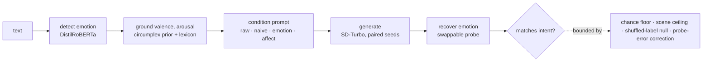
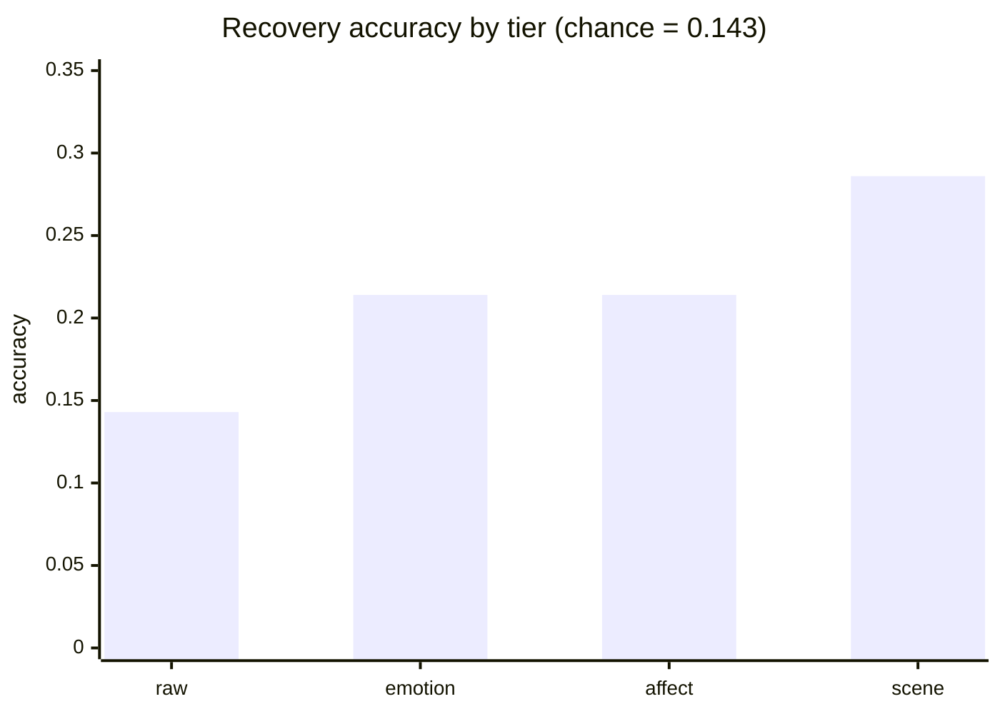
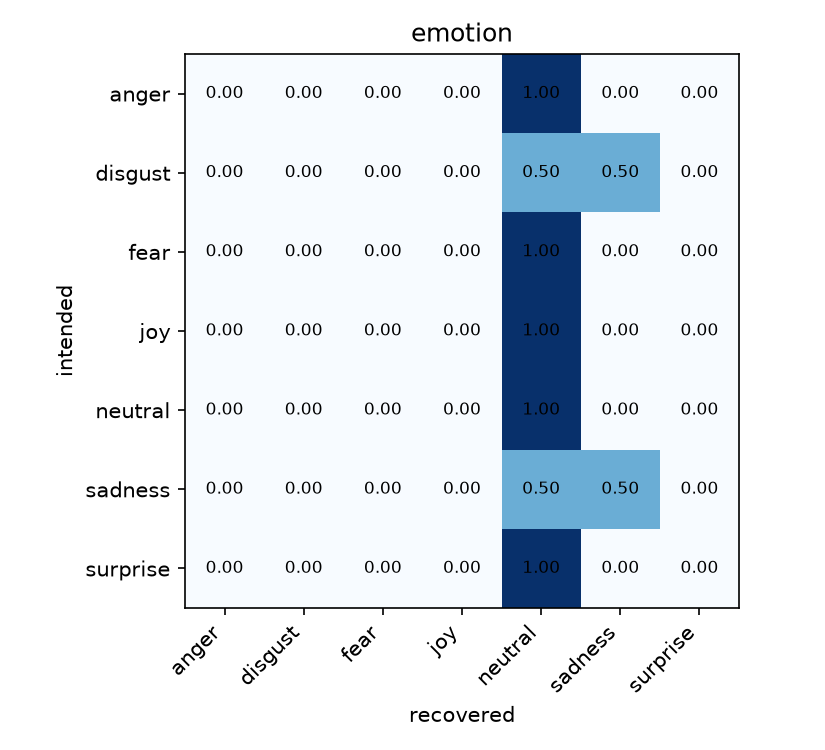
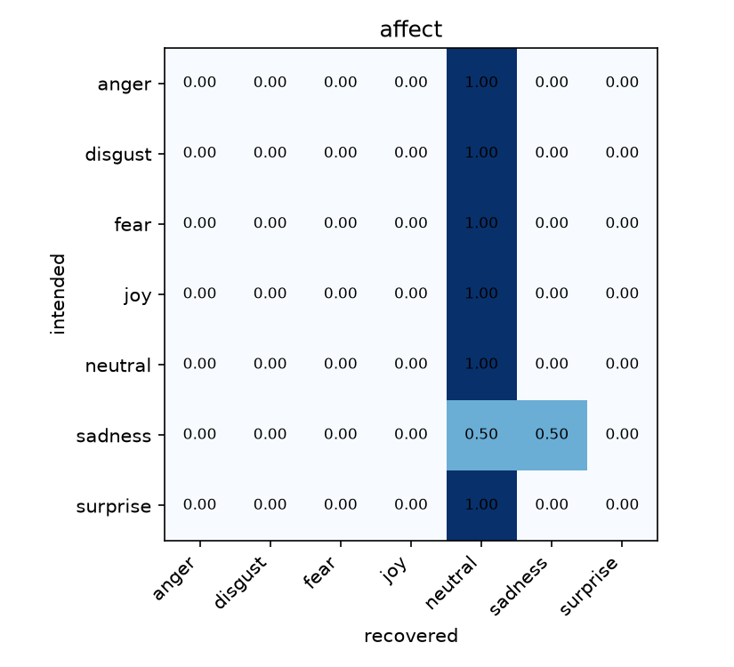
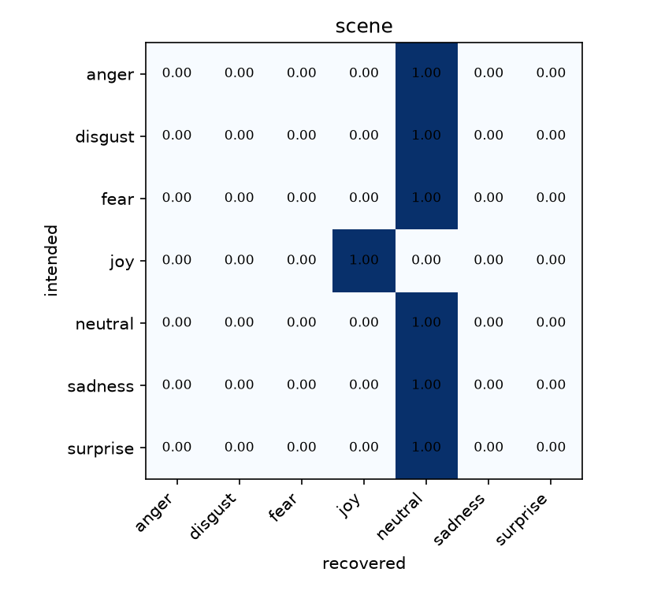
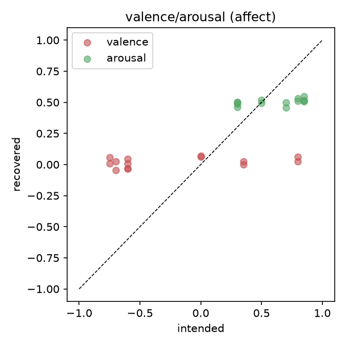

# NovaVision

### The Control You Prompt Is Not the Control You Get: Measuring Emotion Steering in Text-to-Image Generation

[Paper](paper/paper.pdf) · [Colab](reproduce.ipynb) · [Preregistration](PREREGISTRATION.md) · [Benchmark](#benchmark-your-system)

<p align="center">

</p>

**Can emotion conditioning steer what a generated image conveys?** **Not measurably yet: under a protocol built to catch self-deception, no conditioning tier beats chance, and the apparent lift vanishes once the probe's measured error is corrected for.**

## Method

- Detect the emotion in a sentence (DistilRoBERTa), ground it in valence and arousal.
- Condition a prompt on it, tier by tier; generate with SD-Turbo on paired seeds.
- Recover the emotion from the image with a swappable probe; a match is recovery.
- Bound every number: chance floor, scene ceiling, shuffled-label null, probe-error correction.
- Ship AffectBench plus the harness to score any generator or probe under the same rules.
- Report the pilot as it came out: a guarded null. The probe fails its own gate, so no number is a controllability score yet.

## Pipeline



| Tier | Prompt | Example fragment (sadness)  |
|---|---|---|
| raw | content + style | negative control, no emotion at all |
| naive | content + emotion word | "sadness" |
| emotion | content + mood phrase | "sad melancholic mood, somber wistful atmosphere" |
| affect | emotion tier + palette and lighting from valence, arousal | "cool desaturated palette, muted blue-grey tones, soft gentle lighting" |
| scene | fixed per-emotion scene, no content | "a misty rain-soaked forest at dusk" (template ceiling) |

- Valence maps to palette: warm golden above +0.33, cool blue-grey below -0.33.
- Arousal maps to lighting: dramatic high contrast above 0.66, soft and calm below 0.33.

## Results

CPU pilot: SD-Turbo generator, CLIP ViT-B/32 probe, 256 px, n = 14 per tier. Read it as a calibration of the instrument, not a controllability score. The naive tier postdates the committed pilot, so it has no committed numbers yet.

| Tier | Recovery acc [95% CI] | Macro-F1 | Shuffled-label p | Reading  |
|---|---|---|---|---|
| raw (negative control) | 0.143 [0.00, 0.36] | 0.038 | 0.857 | exactly chance (1/7) |
| emotion | 0.214 [0.00, 0.43] | 0.112 | 0.226 | not above circularity |
| affect | 0.214 [0.00, 0.43] | 0.133 | 0.137 | not above circularity |
| scene (template ceiling) | 0.286 [0.00, 0.58] | 0.184 | 0.145 | highest, still n.s. |



| Recovery accuracy vs chance | Raw-tier confusion: the collapse |
|:---:|:---:|
|  |  |

- Probe collapse: 2 of 7 labels used, neutral 90% of the time.
- Rogan-Gladen probe-error correction: 0.214 falls back to 0.165, chance.
- Holm across tiers: nothing survives, adjusted p = 0.27.
- Paired contrasts: emotion +0.071 over raw (Cohen's h = 0.19, p = 0.26); affect adds nothing.
- Chance equals the majority baseline, 0.143: a collapsed probe scores it whatever the image shows.

**All confusion matrices and the valence-arousal map:**

| Emotion tier | Affect tier |
|:---:|:---:|
|  |  |

| Scene ceiling | Valence, arousal by emotion |
|:---:|:---:|
|  |  |

Full write-up: [paper/paper.pdf](paper/paper.pdf). The records and derived metrics are drift-locked by make repro-check in CI; the tables here are rendered snapshots of the same artifacts (make paper).

## Checks

One per failure mode, in the style of an instrument audit:

| Check | Question | Result  |
|---|---|---|
| Chance floor (raw) | Does no-emotion score above 1/7? | 0.143, exactly chance |
| Template ceiling (scene) | How much is pure scene recognition? | 0.286, the upper bound |
| Decoupled content | Can emotion leak through the subject? | No: a bank of 20 neutral subjects, same seed across tiers per item |
| Shuffled labels (n = 2000) | Is recovery just chance agreement? | emotion p = 0.23, affect p = 0.14 |
| Holm correction | Does anything survive family-wise control? | No, adjusted p = 0.27 |
| Probe collapse diagnostic | Is the probe even using its labels? | 2 of 7 labels, 90% neutral |
| Rogan-Gladen correction | Does the lift outlive probe error? | 0.214 corrects to 0.165, chance |
| Provenance manifest | Could numbers drift silently? | git SHA, model revisions, device, benchmark hash logged per run |

**Probe gate.** A probe must read real images before its verdict on generated ones counts:

| Probe | Faces | Scenes (EmoSet) | Verdict  |
|---|---|---|---|
| CLIP ViT-B/32 (pilot) | 29.0% | 40.3% | fails the gate |
| CLIP ViT-L/14 | 37.5% | 45.5% | candidate (McNemar p = 0.038 / 0.040) |

## Run it

Reproduce the committed numbers, no GPU, seconds:

```bash
make setup && make test && make repro-check    # 200 tests, then re-derive the committed metrics
```

Try the app:

```bash
make setup-ml && make app        # http://127.0.0.1:8000, make serve-prod BIND=0.0.0.0:8000 to expose
```

No local setup: [reproduce.ipynb](reproduce.ipynb) runs clone, install, test, reproduce in Colab.

| Main interface | Emotion analysis |
|:---:|:---:|
|  |  |

## Benchmark your system

```bash
make reproduce DIFFUSION_MODEL=<hf-id>   # any Hugging Face diffusion model, frozen protocol
make validate-probe-scene                # gate a candidate probe on EmoSet
make submission SYSTEM="name"            # schema-validated, numbers copied from results
```

| System | Track | raw | emotion | affect | scene | Cleared shuffled-label?  |
|---|---|---|---|---|---|---|
| SD-Turbo + CLIP ViT-B/32 (pilot) | content | 0.143 | 0.214 | 0.214 | 0.286 | no, a guarded null |

Submissions validate against [benchmark/submission.schema.json](benchmark/submission.schema.json). Also useful: make power (sample size), make correct-recovery (probe-error correction), make validate-probe-hf (non-CLIP probe).

## Pilot vs powered run

| Parameter | Committed pilot | Powered run (registered)  |
|---|---|---|
| Generator | stabilityai/sd-turbo, pinned | same, swappable via DIFFUSION_MODEL |
| Probe | CLIP ViT-B/32, pinned | gate-passing probe, ViT-L/14 candidate |
| Image size | 256 x 256 | 512 x 512 |
| Subjects x seeds | 2 x 1 | 20 x 3 |
| n per tier | 14 (scene 7) | 420 (scene 21) |
| Power | n/a | 95%+ for effect strength s = 0.2, make power |

## Key terms

| Term | Meaning  |
|---|---|
| Valence, arousal | How positive and how activated an emotion is; the two axes of Russell's circumplex |
| Tier | One rung of the conditioning ladder: raw, naive, emotion, affect |
| Probe | The model that reads the emotion back off the generated image |
| Recovery accuracy | How often the probe's read matches the intended emotion |
| Shuffled-label control | Rerun scoring with targets randomly reassigned; real signal must beat it |
| Probe gate | Minimum accuracy on real images before a probe's verdict counts |

## Tech stack

| Layer | Tools  |
|---|---|
| ML | PyTorch, Transformers, Diffusers (SD-Turbo), CLIP, DistilRoBERTa |
| App | Flask, gunicorn |
| Research | NumPy, Pillow, matplotlib, HF datasets (GoEmotions, EmoSet) |
| Quality | pytest, ruff, mypy, gitleaks, pip-audit, GitHub Actions, Docker, uv |

## References

- [Russell (1980)](https://doi.org/10.1037/h0077714): the circumplex model, the valence and arousal axes.
- [Demszky et al. (2020)](https://arxiv.org/abs/2005.00547): GoEmotions, the text source AffectBench is built from.
- [Radford et al. (2021)](https://arxiv.org/abs/2103.00020): CLIP, the default probe, treated as an instrument to validate.
- [Sauer et al. (2023)](https://arxiv.org/abs/2311.17042): adversarial diffusion distillation, the SD-Turbo generator.
- [Yang et al. (2023)](https://arxiv.org/abs/2307.07961): EmoSet, the in-domain set the probe ceiling is measured on.

## License

[MIT License](LICENSE)
