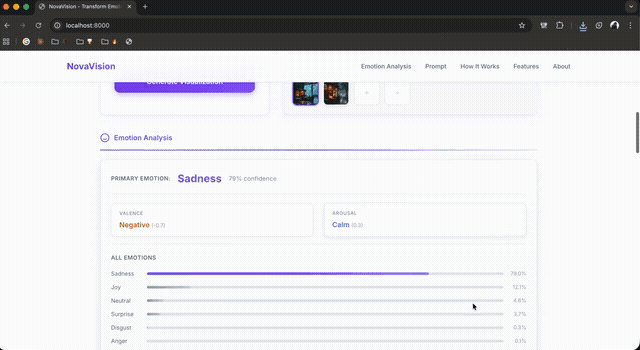
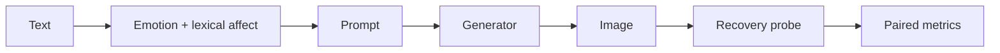
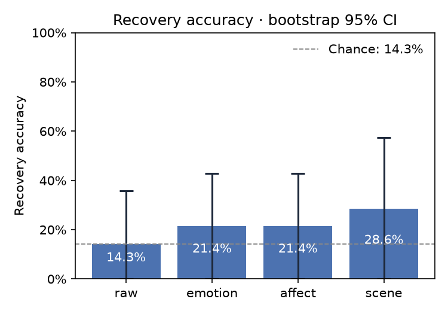
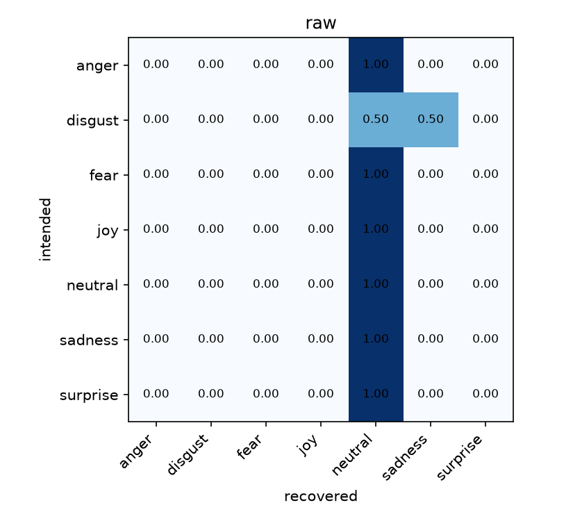
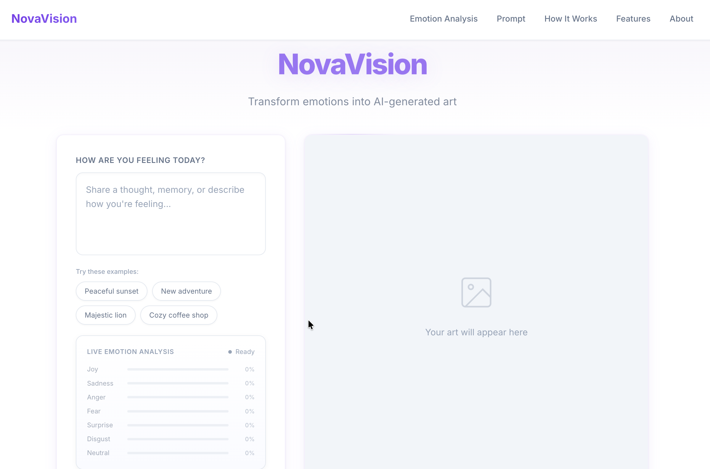
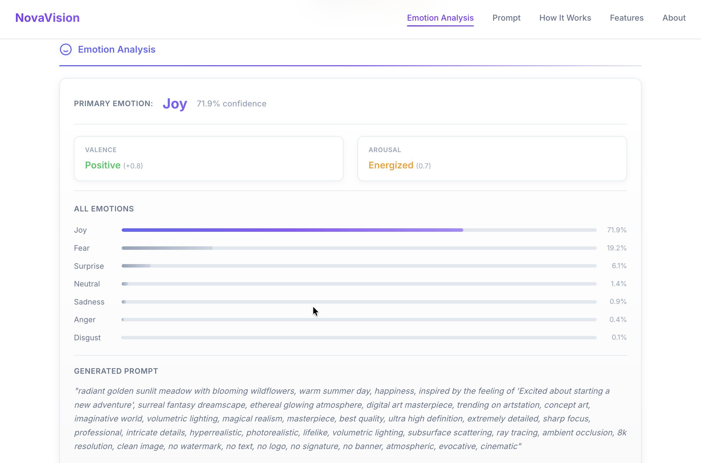

# NovaVision

Emotion-guided images · paired recovery evaluation

[Notebook](reproduce.ipynb) · [Development](CONTRIBUTING.md)

  

## Overview

English text → emotion-conditioned images. The saved pilot **does not establish emotion controllability**.

### Data flow

```mermaid
flowchart LR
    T[Text] --> A[Emotion + lexical affect] --> P[Prompt] --> G[Generator]
    G --> I[Image] --> R[Recovery probe] --> M[Paired metrics]
```

## Results

**SD-Turbo · CLIP B/32 · CPU · 256 px · 2 neutral prompts · 1 seed**

| Tier | n | Recovery | Bootstrap 95% CI | Permutation p |
|---|---:|---:|---:|---:|
| Raw | 14 | 14.3% | 0–35.7% | .857 |
| Emotion | 14 | 21.4% | 0–42.9% | .226 |
| Affect | 14 | 21.4% | 0–42.9% | .137 |
| Scene | 7 | 28.6% | 0–57.5% | .145 |

**Chance: 14.3%.** No conditioning tier survives Holm correction; naive is unmeasured.

| Recovery, 95% CI | Raw confusion |
|:---:|:---:|
|  |  |

[All figures](outputs/figures) · [Records](outputs/results/results.json)

### Probe diagnostics

| Probe | Faces, n=200 | Scenes, n=400 |
|---|---:|---:|
| CLIP B/32 | 29.0% | 40.3% |
| CLIP L/14 | 37.5% | 45.5% |

McNemar p: **.040 faces · .038 scenes**. Pilot: **2/7 predicted labels · 90.5% neutral**.

Correction covers **5/7 classes: 10.0% apparent → 16.5% corrected**. Seven-class correction and uncertainty are unavailable.

### Protocol & provenance

1. Shared seeds, neutral content and a separate scene control.
2. Saved-record metrics reproduce; 2,000 permutations test recovery against shuffled labels.
3. Historical source commits, model pins and original images are missing; image replay is unverified.

## Architecture

| Module | Role |
|---|---|
| `affect` | Classifier + lexical affect blended with emotion priors |
| `prompting` | Raw → naive → emotion → affect; scene control |
| `generation` | Local, hosted or synthetic test images |
| `eval` / `experiments` | Probes, statistics, ratings, provenance, guarded resume |
| `outputs/` | Results, figures and generated runs |

## Tech stack

| Layer | Tools |
|---|---|
| App | Python, Flask, Gunicorn, HTML/CSS/JavaScript |
| Models | PyTorch, Transformers, Diffusers, DistilRoBERTa, CLIP |
| Research | NumPy, Pillow, matplotlib, Hugging Face Datasets |

| Interface | Analysis |
|:---:|:---:|
|  |  |

## Limitations

1. **Small pilot:** 14 images/tier; seven scenes; no naive result.
2. **Probe error:** collapsed labels; incomplete correction; no validated controllability score.
3. **Affect:** content uses priors; the demo lexicon lacks empirical norms.

## Future work

1. Validate with ≥3 independent human raters.
2. Evaluate text-grounded affect using research norms.
3. Preregister 420 images/tier; save originals and complete provenance.

## Ethics & data use

1. Predictions do not verify feelings; avoid clinical assessments.
2. Obtain rater consent; respect model/data licenses; fixtures are for tests.
3. Hosted generation shares prompts with its provider; exclude sensitive text.

## References

1. Radford et al. (2021). [CLIP](https://proceedings.mlr.press/v139/radford21a.html). ICML.
2. Sauer et al. (2023). [Adversarial Diffusion Distillation](https://arxiv.org/abs/2311.17042).
3. Demszky et al. (2020). [GoEmotions](https://aclanthology.org/2020.acl-main.372/). ACL.
4. Yang et al. (2023). [EmoSet](https://arxiv.org/abs/2307.07961). ICCV.

## License

[MIT](LICENSE)
